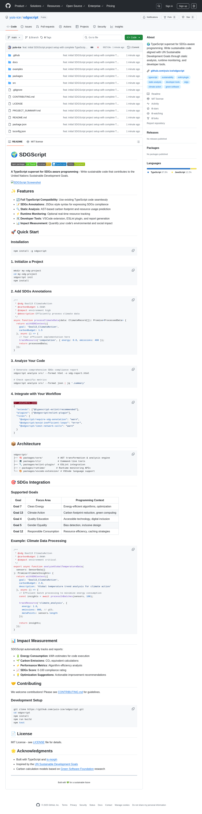

# 🌍 SDGScript

[](https://badge.fury.io/js/sdgscript)
[](https://opensource.org/licenses/MIT)
[](https://typescriptlang.org/)
[](https://sdgs.un.org/)

**A TypeScript superset for SDGs-aware programming** - Write sustainable code that contributes to the United Nations Sustainable Development Goals.



## ✨ Features

- **🔄 Full TypeScript Compatibility**: Use existing TypeScript code seamlessly
- **📝 SDGs Annotations**: JSDoc-style syntax for expressing SDGs compliance
- **🔍 Static Analysis**: AST-based carbon footprint and resource usage prediction
- **⚡ Runtime Monitoring**: Optional real-time resource tracking
- **🛠️ Developer Tools**: VSCode extension, ESLint plugin, and report generation
- **📊 Impact Measurement**: Quantify your code's environmental and social impact

## 🚀 Quick Start

### Installation

```bash
npm install -g sdgscript
```

### 1. Initialize a Project

```bash
mkdir my-sdg-project
cd my-sdg-project
sdgscript init
npm install
```

### 2. Add SDGs Annotations

```typescript
/**
 * @sdg Goal13 ClimateAction
 * @carbonBudget 1.5kWh
 * @impact environment high
 * @description Efficiently process climate data
 */
async function processClimateData(data: ClimateRecord[]): Promise<ProcessedData> {
  return withSDGContext({
    goal: 'Goal13_ClimateAction',
    carbonBudget: 1.5
  }, async () => {
    // Your efficient implementation here
    trackResource('computation', { energy: 0.8, emissions: 400 });
    return processedData;
  });
}
```

### 3. Analyze Your Code

```bash
# Generate comprehensive SDGs compliance report
sdgscript analyze src/ --format html -o sdg-report.html

# Check specific metrics
sdgscript analyze src/ --format json | jq '.summary'
```

### 4. Integrate with Your Workflow

```json
// .eslintrc.json
{
  "extends": ["@typescript-eslint/recommended"],
  "plugins": ["@sdgscript/eslint-plugin"],
  "rules": {
    "@sdgscript/require-sdg-annotation": "warn",
    "@sdgscript/avoid-inefficient-loops": "error",
    "@sdgscript/limit-network-calls": "warn"
  }
}
```

## 📦 Architecture

```
sdgscript/
├── 🧠 packages/core/           # AST transformation & analysis engine
├── 💻 packages/cli/            # Command-line tools
├── 🔧 packages/eslint-plugin/  # ESLint integration
├── ⚡ packages/runtime/        # Runtime monitoring APIs
└── 🎨 packages/vscode-extension/ # VSCode language support
```

## 🎯 SDGs Integration

### Supported Goals

| Goal | Focus Area | Programming Context |
|------|------------|-------------------|
| **Goal 7** | Clean Energy | Energy-efficient algorithms, optimization |
| **Goal 13** | Climate Action | Carbon footprint reduction, green computing |
| **Goal 4** | Quality Education | Accessible technology, digital inclusion |
| **Goal 5** | Gender Equality | Bias detection, inclusive design |
| **Goal 12** | Responsible Consumption | Resource efficiency, caching strategies |

### Example: Climate Data Processing

```typescript
/**
 * @sdg Goal13 ClimateAction
 * @carbonBudget 2.0kWh
 * @impact environment critical
 */
export async function analyzeGlobalTemperatureData(
  sensors: SensorData[]
): Promise<ClimateInsights> {
  return withSDGContext({
    goal: 'Goal13_ClimateAction',
    carbonBudget: 2.0,
    description: 'Global temperature trend analysis for climate action'
  }, async () => {
    // Efficient batch processing to minimize energy consumption
    const insights = await processInBatches(sensors, 100);
    
    trackResource('climate_analysis', {
      energy: 1.8,
      emissions: 900, // gCO₂
      dataPoints: sensors.length
    });
    
    return insights;
  });
}
```

## 📊 Impact Measurement

SDGScript automatically tracks and reports:

- **🔋 Energy Consumption**: kWh estimates for code execution
- **🌱 Carbon Emissions**: CO₂ equivalent calculations
- **⚡ Performance Metrics**: Algorithm efficiency analysis
- **📈 SDGs Score**: 0-100 compliance rating
- **💡 Optimization Suggestions**: Actionable improvement recommendations

## 🤝 Contributing

We welcome contributions! Please see [CONTRIBUTING.md](CONTRIBUTING.md) for guidelines.

### Development Setup

```bash
git clone https://github.com/yuis-ice/sdgscript.git
cd sdgscript
npm install
npm run build
npm test
```

## 📄 License

MIT License - see [LICENSE](LICENSE) file for details.

## 🌟 Acknowledgments

- Built with TypeScript and [ts-morph](https://github.com/dsherret/ts-morph)
- Inspired by the [UN Sustainable Development Goals](https://sdgs.un.org/)
- Carbon calculation models based on [Green Software Foundation](https://greensoftware.foundation/) research

---

<div align="center">
  <sub>Built with 💚 for a sustainable future</sub>
</div>
